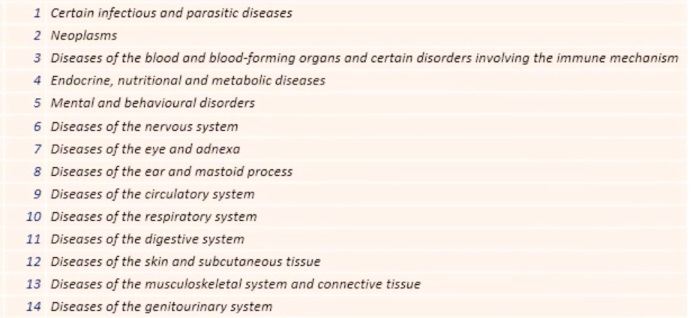

Employee Absence Probability Analysis

This project aims to predict the likelihood of employees being absent from work for more than three hours. Using a dataset with various reasons for absence and personal information, we conducted preprocessing, feature transformation, and classification modeling to achieve insights.

Project Steps
Data Preprocessing and Transformation:

Reasons for absence were grouped into four main categories.
Educational levels were standardized.
Certain data points were simplified to facilitate analysis.
Prediction Model:

After preprocessing, we developed a model to predict the probability of employees being absent for over three hours.
Analysis of Predicted Outcomes:

A detailed analysis was conducted in Tableau to visualize the probability of absence across age, reason categories, transportation expenses, and family characteristics.
Tableau visualization: https://public.tableau.com/views/AnalyzethePredictedOutputs_17316767849850/AnalyzethePredictedOutputs?:language=en-US&:sid=&:redirect=auth&:display_count=n&:origin=viz_share_link

Key Findings
Age and Absence Probability:

Most employees in our data set are aged 43 or younger.
For instance, a 32-year-old has a 73% chance of being absent for more than three hours, while a 39-year-old has only a 22% chance.

Reasons for Absence:

Group 1 Reasons: Probability of absence over three hours is generally above 50%. This category includes serious health-related reasons.

Group 3 Reasons: Due to limited data and dispersed probabilities, this category does not provide a reliable prediction pattern.

Group 4 Reasons: Representing lighter causes like dental appointments or routine consultations, reasons from this group show less than a 50% chance of prolonged absence.

Transportation Expenses and Family Situation:

There's a positive correlation between transportation expenses and likelihood of absence. People with higher monthly transportation expenses tend to have higher probabilities of excessive absence.

Employees with no children generally exhibit a lower probability of prolonged absence and also lower transportation costs.

Among individuals with two children, the transportation expenses mostly center around $220–$240 per month.

